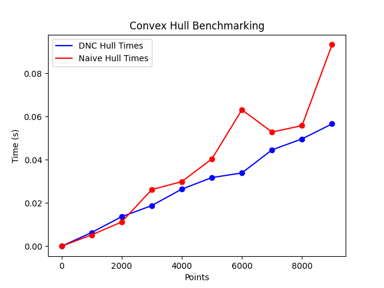

# A2: Divide and Conquer (Convex Hull)

## Benchmarking & Analysis

| # of Points | DNC Hull Time (s) | Naive Hull Time (s) |
| --- | --- | --- |
| 0 | n/a | n/a |
| 1000 | n/a | n/a |
| 2000 | n/a | n/a |
| 3000 | n/a | n/a |
| 4000 | n/a | n/a |
| 5000 | n/a | n/a |
| 6000 | n/a | n/a |
| 7000 | n/a | n/a |
| 8000 | n/a | n/a |
| 9000 | n/a | n/a |

The table above benchmarks the time taken to compute the convex hull of a set of points using the Divide and Conquer (DNC) algorithm and the Naive algorithm. The number of points ranges from 0 to 9000. The time taken is measured in seconds.

**Source Code**: [convex_hull.py](src/convex_hull.py)

**Benchmarking Code**: [benchmarks.py](src/benchmarks.py)

The plot above shows the benchmarking results. The x-axis represents the number of points, and the y-axis represents the time taken in seconds. The blue line represents the time taken by the DNC algorithm, and the orange line represents the time taken by the Naive algorithm.

Analyzing the ... (add analysis here)
