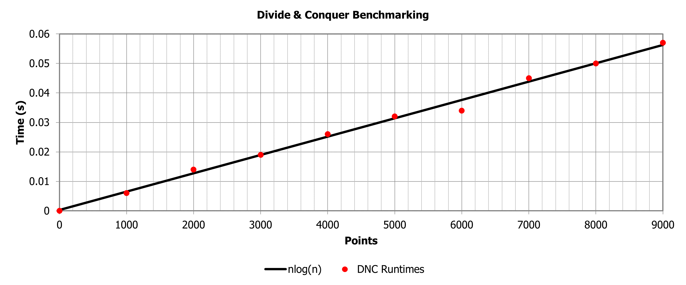
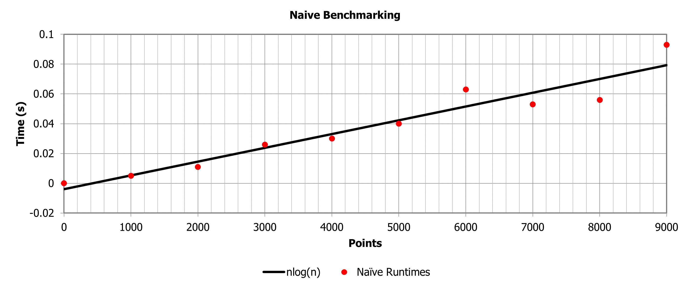

# A2: Divide and Conquer (Convex Hull)

## Invariant Documentation

### 1. Base Case Function (base_case_hull)

The size of points remains at most 5 throughout the execution of the function. This is ensured by the condition “if len(points) <= 5” within the compute_hull function. Thus, an invariant here is that the number of points remains 5 or fewer.

### 2. Merge Function (merge_hulls)

The upper tangent point (upper_tangent) and lower tangent point (lower_tangent) are continuously updated to maintain the correct tangent points between the left and right hulls. These variables make sure that the upper and lower hulls are connected properly. The upper tangent remains a valid tuple (Left Point, Right Point) where i is an index in L and j is an index in R. The lower tangent remains a valid tuple (Left Point, Right Point) where i is an index in L and j is an index in R.

### 3. Compute Hull Function (compute_hull)

The input list points are sorted at the beginning of the function and remain sorted throughout the execution. This is indicated by points.sort() which maintains the order of points to be organized in increasing x-values.

## Benchmarking & Analysis

### Hardware Specifications

- **Processor**: AMD Ryzen 7 3700X 8-Core Processor, 3600 Mhz, 8 Core(s), 16 Logical Processor(s)
- **Architecture**: x64-based PC
- **Physical Memory (RAM)**: 32.0 GB
- **Storage**: Samsung SSD 970 EVO Plus 2TB (NVMe M.2)

### Benchmarking

The table below outlines the benchmark times for our two convex hull computation algorithms given some ``0 <= n <= 9000`` randomly placed input points. As expected, our Divide and Conquer (DNC) algorithm outperforms our Jarvis March (Naive) algorithm by a substantial margin.

| # of Points | DNC Hull Time (s) | Naive Hull Time (s) |
| --- | --- | --- |
| 0 | 0.000 | 0.000 |
| 1000 | 0.006 | 0.005 |
| 2000 | 0.014 | 0.011 |
| 3000 | 0.019 | 0.026 |
| 4000 | 0.026 | 0.030 |
| 5000 | 0.032 | 0.040 |
| 6000 | 0.034 | 0.063 |
| 7000 | 0.045 | 0.053 |
| 8000 | 0.050 | 0.056 |
| 9000 | 0.057 | 0.093 |

### Analysis

Plotting our benchmark data, we can see the difference in our algorithms clearly, which is great, but let's take a look at how each algorithm stacks up against the expected ``nlog(n)``.

As demonstrated by the graphs below, our algorithms are both performing as expected when compared to the line ``nlog(n)``. The DNC algorithm consistently performs along or beneath the plotted line ``nlog(n)`` with margin room for error, whereas the Naive algorithm tends to jump above and below this trendline frequently and dramatically, presenting a much larger margin for error.

> Do note, the graphs below do NOT share the same y-axis scale.

One thing worth considering is the randomly generated data set for this particular execution when benchmarking. There is, of course, some variety in benchmarking results based upon how "difficult" a particular arrangement is to compute. As such, there are some instances where both algorithms may perform similarly, but this is not due to any correlation in the algorithms themselves.

